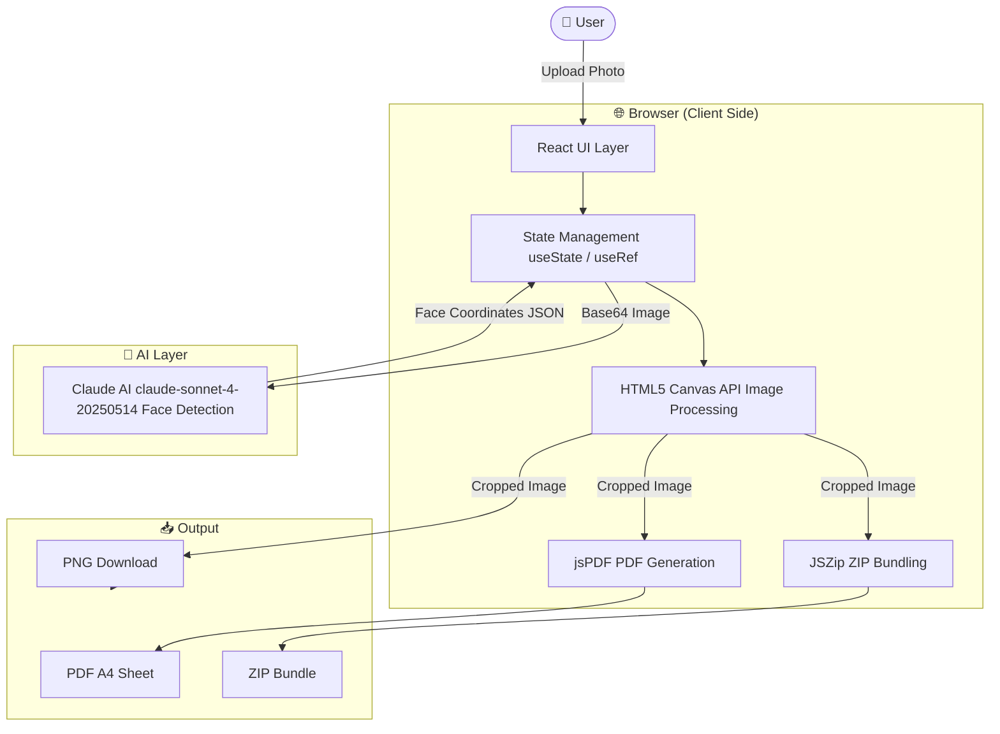
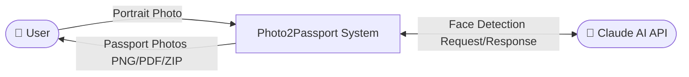
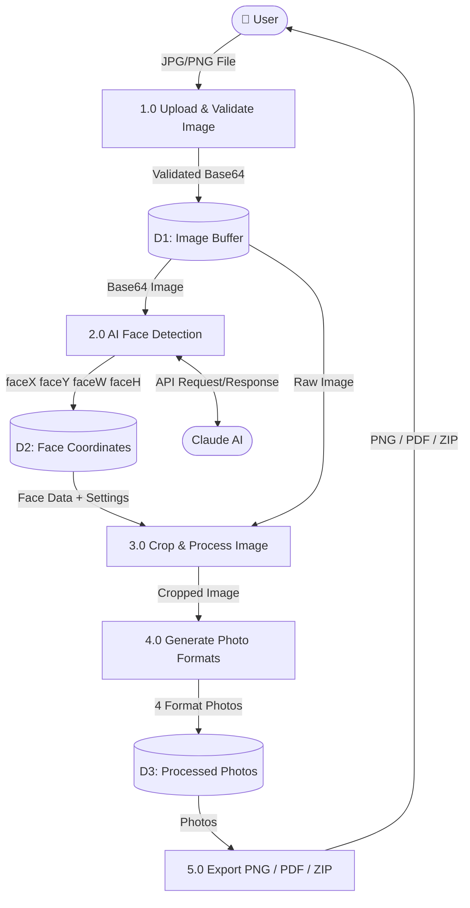
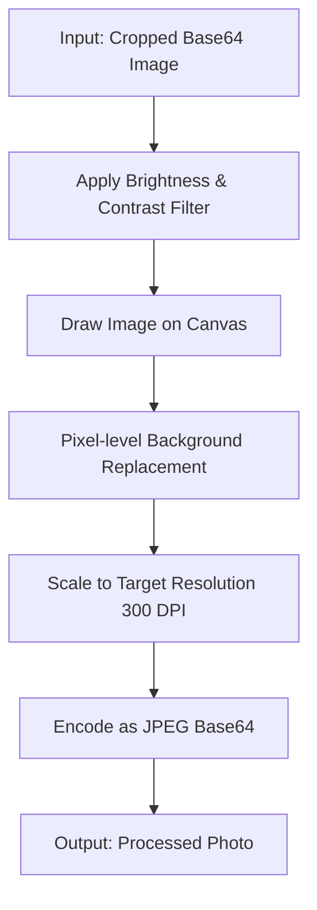
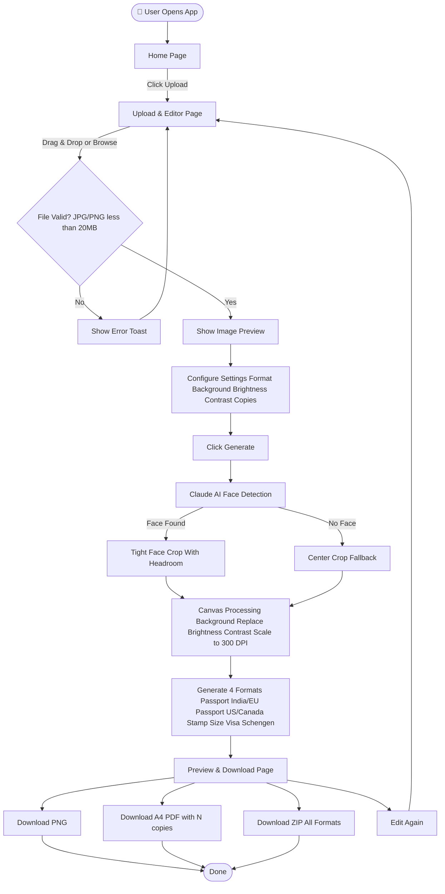

# 📸 Photo2Passport

<div align="center">


[](https://photo2passports.netlify.app/)
[](https://github.com/amith6491-netizen/photo2passport)
[](https://photo2passports.netlify.app/)
[](https://react.dev/)
[](https://vitejs.dev/)
[](https://anthropic.com/)

**A modern AI-powered web application that converts personal photos into professional passport-size, visa-size, and stamp-size photos instantly — right in your browser.**

[🌐 Live Demo](https://.netlify.app/) · [🐛 Report Bug](https://github.com/amith6491-netizen/photo2passport/issues) · [✨ Request Feature](https://github.com/amith6491-netizen/photo2passport/issues)

</div>

---

## 📋 Table of Contents

- [About The Project](#about-the-project)
- [Live Demo](#live-demo)
- [Features](#features)
- [Tech Stack](#tech-stack)
- [System Architecture](#system-architecture)
- [Data Flow Diagram DFD](#data-flow-diagram-dfd)
- [Context Flow Diagram CFD](#context-flow-diagram-cfd)
- [Supported Formats](#supported-formats)
- [Getting Started](#getting-started)
- [Project Structure](#project-structure)
- [How It Works](#how-it-works)
- [License](#license)

---

## 🎯 About The Project

**Photo2Passport** is a fully client-side React application that leverages **Claude AI (Anthropic)** for intelligent face detection and the **HTML5 Canvas API** for high-fidelity image processing at 300 DPI.

Unlike traditional passport photo tools, Photo2Passport:
- Processes everything **in your browser** — no data is sent to any server
- Uses **AI to detect and center your face** automatically
- Generates photos that meet **international passport standards**
- Produces **print-ready A4 PDF layouts** at 300 DPI

---

## 🌐 Live Demo

👉 **[https://photo2passports.netlify.app/](https://photo2passports.netlify.app/)**

---

## ✨ Features

| Feature | Description |
|--------|-------------|
| 🤖 AI Face Detection | Claude AI precisely locates and centres the face |
| 📐 Auto Crop & Align | Intelligent crop with proper headroom and shoulder space |
| 🎨 Background Control | White, sky blue, gray, cream, or any custom color |
| ☀️ Brightness & Contrast | Fine-tune photo quality before generating |
| 🖨️ A4 Print Layout | Arrange up to 40 copies on a single A4 sheet at 300 DPI |
| 📥 Multiple Downloads | Export as PNG, PDF, or ZIP bundle |
| 🌙 Dark / Light Mode | Full theme switching support |
| 📱 Mobile Responsive | Works perfectly on all screen sizes |
| 🔒 100% Private | All processing happens locally in the browser |
| ⚡ Instant Preview | Live brightness and contrast preview before processing |

---

## 🛠️ Tech Stack

### Frontend


### AI & Processing


### Deployment


---

## 🏗️ System Architecture



---

## 📊 Data Flow Diagram (DFD)

### Level 0 — Context Diagram



---

### Level 1 — DFD



---

### Level 2 — Image Processing DFD



---

## 🔄 Context Flow Diagram (CFD)



---

## 📐 Supported Photo Formats

| Format | Size | Resolution | Use Case |
|--------|------|------------|---------|
| 🇮🇳 Passport India / EU | 35 x 45 mm | 413 x 531 px at 300 DPI | Indian passport, EU documents |
| 🇺🇸 Passport US / Canada | 51 x 51 mm | 603 x 603 px at 300 DPI | US/Canada passport |
| 📮 Stamp Size | 25 x 30 mm | 295 x 354 px at 300 DPI | Stamp-size identity photos |
| 🇪🇺 Visa Schengen | 35 x 45 mm | 413 x 531 px at 300 DPI | Schengen visa applications |

---

## 🚀 Getting Started

### Prerequisites

- Node.js 18+
- npm or yarn

### Installation

```bash
# Clone the repository
git clone https://github.com/amith6491-netizen/photo2passport.git

# Navigate to project directory
cd photo2passport

# Install dependencies
npm install

# Start development server
npm run dev
```

Open [http://localhost:5173](http://localhost:5173) in your browser.

### Build for Production

```bash
npm run build
```

### Deploy to Netlify

```bash
# Build first
npm run build

# Drag and drop the dist/ folder to
# https://app.netlify.com/drop
```

---

## 📁 Project Structure

```
photo2passport/
├── public/
│   └── favicon.svg
├── src/
│   ├── App.jsx          # Main application component
│   ├── main.jsx         # React entry point
│   ├── App.css          # Global styles
│   └── index.css        # Base styles
├── dist/                # Production build output
├── index.html           # HTML entry point
├── vite.config.js       # Vite configuration
├── vercel.json          # Vercel deployment config
├── package.json         # Dependencies
└── README.md            # Project documentation
```

---

## ⚙️ How It Works

### Step 1 — Upload
User uploads a JPG or PNG portrait photo via drag-and-drop or file picker. The file is validated for type and size, then converted to Base64.

### Step 2 — AI Face Detection
The Base64 image is sent to **Claude AI (claude-sonnet-4-20250514)** which returns face coordinates as JSON:
```json
{
  "faceX": 0.5,
  "faceY": 0.35,
  "faceW": 0.38,
  "faceH": 0.40,
  "ok": true
}
```

### Step 3 — Canvas Crop & Process
The HTML5 Canvas API uses face coordinates to:
- Calculate the optimal crop zone with proper headroom
- Apply brightness and contrast filters
- Replace background pixels with the selected color
- Scale to exact 300 DPI pixel dimensions

### Step 4 — Generate Formats
All 4 photo formats are generated simultaneously on separate canvas elements.

### Step 5 — Export
- **PNG** — Direct canvas download
- **PDF** — jsPDF arranges N copies on an A4 canvas at 300 DPI
- **ZIP** — JSZip bundles all formats and A4 layouts

---

## 🔒 Privacy

> All image processing happens **entirely in your browser**.
> Your photos are **never uploaded to any server**.
> Only a temporary anonymised crop request is sent to the Claude AI API.
> No images are stored anywhere.

---

## 👨‍💻 Author

**Amith** — [@amith6491-netizen](https://github.com/amith6491-netizen)

---

## 📄 License

This project is licensed under the **MIT License**.

---

<div align="center">
Made with ❤️ by <a href="https://github.com/amith6491-netizen">amith6491-netizen</a>
<br/>
⭐ Star this repo if you found it helpful!
</div>
